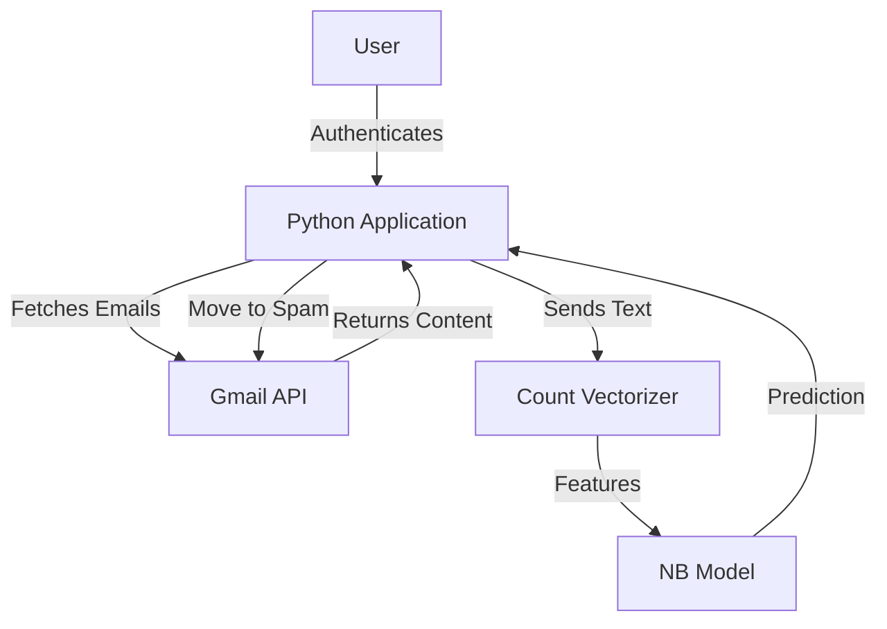

# Project Synopsis: Intelligent Gmail Spam Remover

## Table of Contents
1. [Introduction](#introduction)
2. [Problem Statement](#problem-statement)
3. [Objectives](#objectives)
4. [Scope of the Project](#scope-of-the-project)
5. [Literature Review](#literature-review-optional)
6. [System Overview](#system-overview)
7. [Architecture Diagram](#architecture-diagram)
8. [System Flow](#system-flow)
9. [Methodology](#methodology)
10. [Algorithms Used](#algorithms-used)
11. [Tools & Technologies](#tools--technologies)
12. [Dataset Description](#dataset-description)
13. [Advantages of the System](#advantages-of-the-system)
14. [Applications](#applications)
15. [Conclusion](#conclusion)
16. [Future Enhancements](#future-enhancements)
17. [References](#references)

---

## Introduction
In the digital age, email is a primary mode of communication. However, this convenience is often marred by the influx of unsolicited messages, known as spam. These emails not only clutter inboxes but can also carry security threats. This project introduces an intelligent solution to automate the detection and removal of spam emails using Machine Learning.

## Problem Statement
Standard email filters provided by service providers are effective but not infallible. They often miss subtle spam or misclassify legitimate emails. Users spend significant time manually sorting and deleting unwanted messages. There is a need for a customizable, automated tool that can interface directly with a user's inbox to identify and manage spam with high accuracy.

## Objectives
- To develop a Python-based application that authenticates securely with a user's Gmail account.
- To train a Machine Learning model (Naive Bayes) to accurately classify emails as Spam or Ham.
- To automate the retrieval of unread emails and apply the classification model in real-time.
- To provide a mechanism for automatically moving detected spam to the Spam folder/Trash.

## Scope of the Project
The project encompasses:
- **Backend Development**: Python scripts for API interaction and model inference.
- **Machine Learning**: detailed preprocessing, vectorization, and model training steps.
- **API Integration**: Secure OAuth 2.0 connection with Google's Gmail API.
- **User Interaction**: a CLI-based interface for monitoring and confirming actions.

## Literature Review (optional)
Traditional spam filtering relies on rule-based systems (checking for keywords like "buy now"). Modern approaches leverage probability and statistical learning. The Naive Bayes classifier is a staple in this domain due to its assumption of feature independence, which works surprisingly well for text classification tasks where the presence of certain words (features) strongly correlates with the class (Spam/Ham).

## System Overview
The system is a standalone Python application that acts as a bridge between the Google Gmail Server and a local Machine Learning engine. It fetches data, processes it locally, and sends commands back to the server to organize the inbox.

## Architecture Diagram

## System Flow
1.  **Initialization**: User runs `run_remover.py` and enters their email address.
2.  **Authentication**: The system checks for `token.json` or initiates an Oauth flow via `gmail_service.py`.
3.  **Model Loading**: The pre-trained `spam_model.pkl` and `vectorizer.pkl` are loaded into memory.
4.  **Scanning**: The app requests the latest 50 unread emails from the Gmail API.
5.  **Classification**:
    *   Email content is decoded.
    *   Text is transformed into a vector.
    *   The model predicts likelihood of Spam.
6.  **Reporting**: Users see a list of flagged emails (Spam) vs Safe emails (Ham).
7.  **Action**: Upon user confirmation, the system moves all identified spam emails to the Spam folder.

## Methodology
The project follows a standard Data Science lifecycle:
1.  **Data Ingestion**: Merging `emails.csv` and `spam_ham_dataset.csv`.
2.  **Preprocessing**: Removing stop words, converting to lowercase, and tokenizing text.
3.  **Training**: Feeding the processed data into a Multinomial Naive Bayes classifier.
4.  **Serialization**: Saving the trained model using `joblib` for efficient reuse.
5.  **Deployment**: Integrating the model into the `SpamFilter` class for use with the live application.

## Algorithms Used
*   **Multinomial Naive Bayes (MNB)**: A variant of Naive Bayes designed for discrete counts (e.g., word counts in text classification). It calculates the probability of a message being spam based on the frequency of its words in the training set.
*   **Bag-of-Words (BoW)**: Implemented via `CountVectorizer`, this converts variable-length text into fixed-length vectors representing word recurrence.

## Tools & Technologies
*   **Programming Language**: Python 3.x
*   **Machine Learning**: Scikit-Learn (`sklearn`)
*   **Data Handling**: Pandas, Numpy
*   **API Client**: `google-api-python-client`, `google-auth-oauthlib`
*   **Format**: JSON (for credentials), CSV (for datasets), PKL (for models)

## Dataset Description
The model is trained on a composite dataset containing thousands of email samples.
*   **Features**: Raw text content of the email.
*   **Labels**: Binary classification (1 = Spam, 0 = Ham).
*   **Source**: Publicly available datasets (e.g., Enron, Kaggle) aggregated into CSV files.

## Advantages of the System
*   **Privacy-Focused**: Analysis happens locally; email content is not sent to third-party analysis servers (other than Google's own storage).
*   **Efficiency**: Rapidly scans unread emails without manual intervention.
*   **Accuracy**: Naive Bayes is highly effective for text-based spam detection with relatively low training overhead.

## Applications
*   **Personal Use**: Individuals managing high-volume inboxes.
*   **Enterprise**: Can be adapted for internal company servers to filter incoming mail.
*   **Data Cleanup**: Useful for retroactive cleaning of old email archives.

## Conclusion
The Intelligent Gmail Spam Remover demonstrates the practical application of Machine Learning in solving everyday digital annoyances. By combining robust API integration with effective text classification algorithms, it provides a valuable tool for maintaining digital hygiene.

## Future Enhancements
*   **GUI**: Developing a graphical user interface (Tkinter or Web) for non-technical users.
*   **Active Learning**: Allowing users to correct misclassifications to retrain and improve the model over time.
*   **Deep Learning**: experimenting with LSTM or BERT models for better context understanding in emails.

## References
1.  Scikit-learn Documentation: https://scikit-learn.org/
2.  Gmail API Documentation: https://developers.google.com/gmail/api
3.  Naive Bayes Classifiers (Stanford NLP): https://web.stanford.edu/
